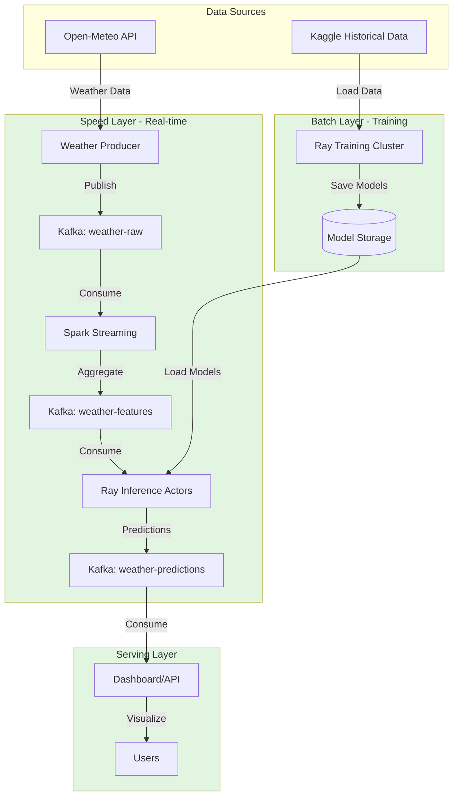
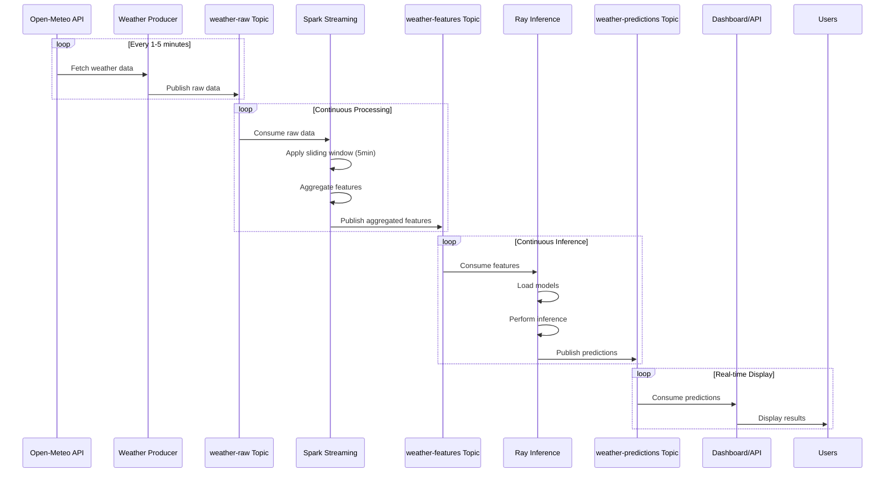
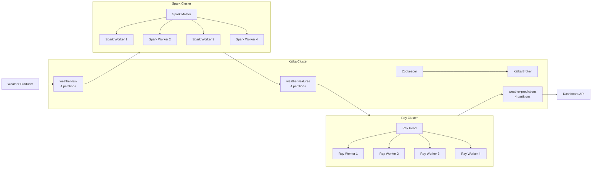
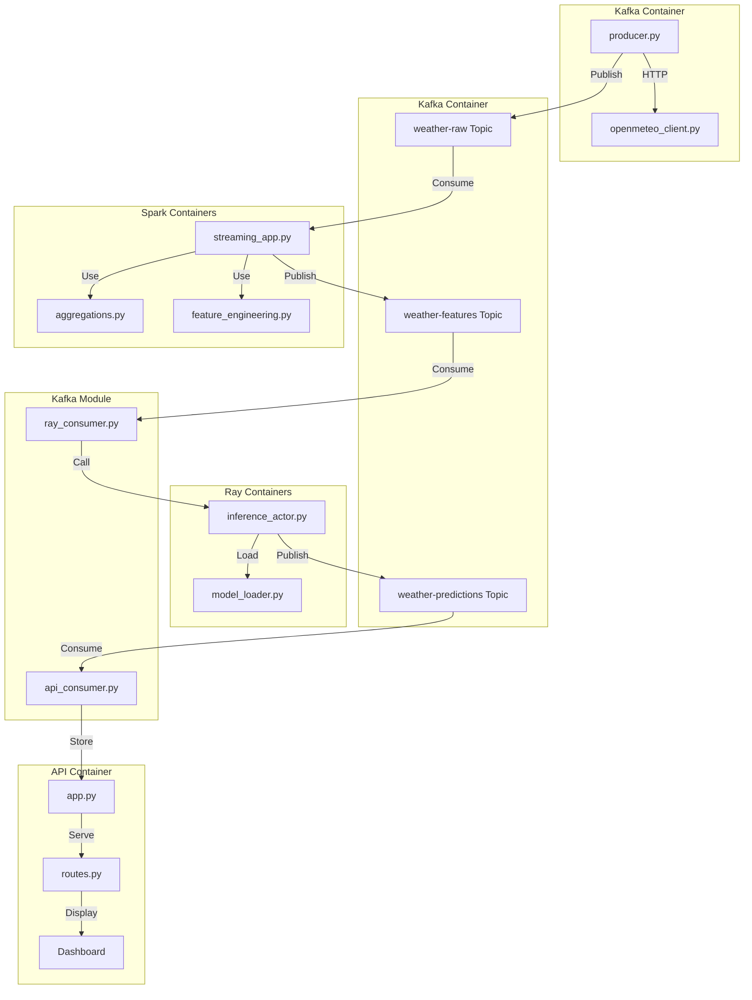
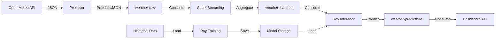
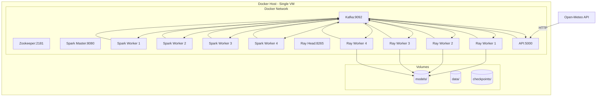

# System Architecture

## Overview

This document describes the system architecture, file structure, and component organization for the Lambda Architecture-based weather forecasting system integrating Kafka, Spark, and Ray.

## High-Level Architecture



## Detailed Data Flow



## Component Architecture



## File Structure

```
ultimateStreamandDistribute_kafka-spark-ray/
│
├── docker-compose.yml              # Docker Compose configuration
├── Dockerfile                      # Base image (if needed)
│
├── README.md                       # Project overview and setup
├── design.md                       # Original design document
├── improved_design.md              # Enhanced design document
├── architecture.md                 # This file
├── checklist.md                    # Project checklist
│
├── src/                            # Source code directory
│   │
│   ├── kafka/                      # Kafka producer, consumers and utilities
│   │   ├── __init__.py
│   │   ├── producer.py             # Main weather producer script
│   │   ├── openmeteo_client.py     # Open-Meteo API client
│   │   ├── stations_config.py      # Weather station configurations
│   │   ├── schema.py               # Data schema definitions
│   │   ├── ray_consumer.py         # Kafka consumer for Ray inference
│   │   ├── api_consumer.py        # Kafka consumer for API/dashboard
│   │   ├── kafka_utils.py          # Shared Kafka utilities
│   │   └── base_consumer.py        # Base consumer class (optional)
│   │
│   ├── spark/                      # Spark streaming application
│   │   ├── __init__.py
│   │   ├── streaming_app.py        # Main Spark Structured Streaming app
│   │   ├── aggregations.py         # Window aggregation logic
│   │   └── feature_engineering.py  # Feature engineering functions
│   │
│   ├── ray/                        # Ray ML components
│   │   ├── __init__.py
│   │   ├── training/              # Training pipeline
│   │   │   ├── __init__.py
│   │   │   ├── train_forecasting.py    # Forecasting model training
│   │   │   ├── train_anomaly.py        # Anomaly detection training
│   │   │   ├── data_loader.py          # Historical data loading
│   │   │   └── model_factory.py        # Model creation
│   │   │
│   │   ├── inference/              # Inference pipeline
│   │   │   ├── __init__.py
│   │   │   ├── inference_actor.py      # Ray inference actor
│   │   │   ├── model_loader.py         # Model loading logic
│   │   │   └── predictor.py            # Prediction logic
│   │   │
│   │   └── models/                 # Model definitions
│   │       ├── __init__.py
│   │       ├── forecasting_model.py    # Forecasting model class
│   │       └── anomaly_model.py        # Anomaly detection model class
│   │
│   ├── api/                        # REST API and Dashboard
│   │   ├── __init__.py
│   │   ├── app.py                 # Flask/FastAPI application
│   │   ├── routes.py              # API routes
│   │   └── dashboard/             # Dashboard frontend
│   │       ├── index.html
│   │       ├── static/
│   │       │   ├── css/
│   │       │   ├── js/
│   │       │   └── images/
│   │       └── templates/
│   │
│   ├── utils/                      # Shared utilities
│   │   ├── __init__.py
│   │   ├── config.py              # Configuration management
│   │   ├── logging_config.py       # Logging setup
│   │   ├── kafka_config.py        # Kafka configuration
│   │   └── helpers.py             # Helper functions
│   │
│   └── tests/                      # Test files
│       ├── __init__.py
│       ├── test_producer.py
│       ├── test_spark.py
│       ├── test_ray.py
│       └── test_integration.py
│
├── config/                         # Configuration files
│   ├── spark-defaults.conf        # Spark configuration
│   └── ray-config.yaml            # Ray configuration
│
├── models/                         # Trained model storage
│   ├── forecasting/
│   │   ├── v1.0/
│   │   ├── v1.1/
│   │   └── latest -> v1.1/
│   └── anomaly/
│       ├── v1.0/
│       ├── v1.1/
│       └── latest -> v1.1/
│
├── data/                           # Data storage
│   ├── raw/                       # Raw data (if storing locally)
│   ├── processed/                 # Processed data
│   └── historical/                # Historical training data
│
├── scripts/                        # Utility scripts
│   ├── setup.sh                   # Initial setup script
│   ├── start_services.sh          # Start all services
│   ├── stop_services.sh           # Stop all services
│   └── train_models.sh            # Trigger model training
│
└── docs/                           # Additional documentation
    ├── api_documentation.md
    ├── deployment_guide.md
    └── troubleshooting.md
```

## Files to Create

### 1. Root Level Files

#### `docker-compose.yml`
- Docker Compose configuration for all services
- Defines: Kafka (with producer), Spark Master, Spark Workers (4x), Ray Head, Ray Workers (4x), API
- Network configuration
- Volume mounts
- Resource limits (32GB RAM total, 12 CPU cores)
- Note: Kafka topics are created automatically by the producer on startup

#### `README.md`
- Project overview
- Quick start guide
- Prerequisites
- Setup instructions

### 2. Kafka Module (`src/kafka/`)

#### `producer.py`
- Main weather producer script
- Creates Kafka topics on startup (`weather-raw`, `weather-features`, `weather-predictions`)
- Fetches data from Open-Meteo API
- Publishes to `weather-raw` Kafka topic
- Handles errors and retries
- Runs continuously

#### `openmeteo_client.py`
- Open-Meteo API client wrapper
- Handles API requests
- Data parsing and validation
- Rate limiting

#### `stations_config.py`
- Weather station configurations (lat/lon, names, IDs)
- List of 10-20 real weather stations

#### `schema.py`
- Data schema definitions
- Protobuf or JSON schema for raw weather data

#### `ray_consumer.py`
- Kafka consumer for Ray inference workers
- Consumes from `weather-features` topic
- Calls Ray inference actors for ML processing
- Publishes predictions to `weather-predictions` topic
- Handles consumer group: `ray-ml-inference`

#### `api_consumer.py`
- Kafka consumer for API/dashboard
- Consumes from `weather-predictions` topic
- Stores results in memory/database for API queries
- Updates dashboard in real-time
- Handles consumer group: `dashboard-consumers`

#### `kafka_utils.py`
- Shared Kafka utilities
- Schema serialization/deserialization
- Kafka configuration helpers
- Common consumer/producer setup

#### `base_consumer.py` (Optional)
- Base consumer class for shared functionality
- Common error handling
- Offset management
- Retry logic

### 3. Spark Module (`src/spark/`)

#### `streaming_app.py`
- Main Spark Structured Streaming application
- Reads from `weather-raw` topic
- Applies windowing and aggregations
- Writes to `weather-features` topic
- Checkpointing configuration

#### `aggregations.py`
- Window aggregation functions
- Mean, std dev, min, max calculations
- Per-station aggregations

#### `feature_engineering.py`
- Feature engineering functions
- Rate of change calculations
- Trend detection
- Derived features

### 4. Ray Training Module (`src/ray/training/`)

#### `train_forecasting.py`
- Forecasting model training script
- Uses Ray Train or Ray actors
- Trains LSTM/Prophet/ARIMA/XGBoost model
- Model evaluation and saving

#### `train_anomaly.py`
- Anomaly detection model training
- Trains Isolation Forest/Autoencoder
- Model evaluation and saving

#### `data_loader.py`
- Loads historical data from Kaggle dataset
- Data preprocessing
- Train/validation/test split

#### `model_factory.py`
- Model creation factory
- Different model architectures
- Hyperparameter configuration

### 5. Ray Inference Module (`src/ray/inference/`)

#### `inference_actor.py`
- Ray actor class for inference
- Model loading on initialization
- Inference methods (forecasting, anomaly detection)
- Batch processing support

#### `model_loader.py`
- Model loading logic
- Model versioning
- Model caching
- Hot-reload support

#### `predictor.py`
- Prediction logic
- Forecasting predictions
- Anomaly detection
- Result formatting

### 6. Ray Models Module (`src/ray/models/`)

#### `forecasting_model.py`
- Forecasting model class definition
- Model architecture
- Prediction methods

#### `anomaly_model.py`
- Anomaly detection model class
- Model architecture
- Anomaly scoring methods

### 7. API Module (`src/api/`)

#### `app.py`
- Flask or FastAPI application
- Main application setup
- Middleware configuration

#### `routes.py`
- API route definitions
- GET /predictions/{station_id}
- GET /predictions/{station_id}/history
- GET /anomalies
- GET /health
- GET /metrics

#### `dashboard/`
- Frontend dashboard files
- HTML, CSS, JavaScript
- Real-time visualization
- Charts and maps

### 8. Utils Module (`src/utils/`)

#### `config.py`
- Configuration management
- Environment variables
- Service URLs and ports

#### `logging_config.py`
- Logging configuration
- Log levels and formats

#### `kafka_config.py`
- Kafka-specific configuration
- Topic names
- Consumer group names

#### `helpers.py`
- General helper functions
- Data transformations
- Utility functions

### 9. Configuration Files (`config/`)

#### `spark-defaults.conf`
- Spark configuration
- Memory settings
- Checkpoint locations

#### `ray-config.yaml`
- Ray cluster configuration
- Resource allocation
- Actor configuration

### 10. Scripts (`scripts/`)

#### `setup.sh`
- Initial project setup
- Creates directories
- Sets permissions

#### `start_services.sh`
- Starts all Docker services
- Waits for dependencies
- Health checks

#### `stop_services.sh`
- Stops all Docker services
- Clean shutdown

#### `train_models.sh`
- Triggers model training
- Runs Ray training pipeline

### 11. Test Files (`src/tests/`)

#### `test_producer.py`
- Unit tests for Kafka producer
- API client tests

#### `test_spark.py`
- Spark streaming tests
- Aggregation tests

#### `test_ray.py`
- Ray actor tests
- Inference tests

#### `test_integration.py`
- End-to-end integration tests
- Full pipeline tests

## Component Communication



## Data Flow Between Components



## Resource Allocation

| Component | Containers | CPU per Container | RAM per Container | Total CPU | Total RAM |
|-----------|-----------|-------------------|-------------------|-----------|-----------|
| Zookeeper | 1 | 1 | 1 GB | 1 | 1 GB |
| Kafka | 1 | 1 | 2 GB | 1 | 2 GB |
| Spark Master | 1 | 1 | 2 GB | 1 | 2 GB |
| Spark Workers | 4 | 1 | 3 GB | 4 | 12 GB |
| Ray Head | 1 | 1 | 2 GB | 1 | 2 GB |
| Ray Workers | 4 | 1 | 3 GB | 4 | 12 GB |
| **TOTAL** | **12** | - | - | **12** | **31 GB** |

## Port Configuration

| Service | Port | Purpose |
|---------|------|---------|
| Kafka | 9092 | Internal broker |
| Kafka | 9093 | External (optional) |
| Zookeeper | 2181 | Coordination |
| Spark Master UI | 8080 | Spark dashboard |
| Ray Dashboard | 8265 | Ray dashboard |
| API/Dashboard | 5000 | REST API |
| API/Dashboard | 3000 | Web dashboard |

## Deployment Architecture



## Key Design Decisions

1. **Multi-Topic Kafka Architecture**: Three topics (`weather-raw`, `weather-features`, `weather-predictions`) for decoupling
2. **4 Workers Each**: 4 Spark workers and 4 Ray workers for parallel processing
3. **1 CPU per Container**: Uniform resource allocation for simplicity
4. **32GB RAM Total**: Efficient resource utilization
5. **Real-World Data**: Open-Meteo API for live data, Kaggle for training
6. **Model Versioning**: Separate directories for model versions
7. **Checkpointing**: Spark checkpoints for fault tolerance
8. **REST API**: Separate API service for serving results

## Visual Dataflow

This diagram shows the complete data flow from source to destination, highlighting where each Kafka consumer receives its data:

```
┌─────────────────────────────────────────────────────────────┐
│                    DATA SOURCE                               │
│  Open-Meteo API (Real weather stations)                     │
│  - Fetches weather data every 1-5 minutes                   │
│  - Multiple stations (10-20 real locations)                   │
└───────────────────────┬─────────────────────────────────────┘
                        │
                        ▼
┌─────────────────────────────────────────────────────────────┐
│                    PRODUCER                                 │
│  producer.py (src/kafka/producer.py)                        │
│  - Fetches from Open-Meteo API                             │
│  - Formats data (JSON/Protobuf)                            │
│  - Publishes to weather-raw                                │
└───────────────────────┬─────────────────────────────────────┘
                        │
                        ▼
┌─────────────────────────────────────────────────────────────┐
│                    KAFKA TOPIC 1                            │
│  weather-raw                                                │
│  - Raw weather data                                        │
│  - Schema: station_id, timestamp, temperature,             │
│    humidity, pressure, wind_speed                          │
│  - 4 partitions (by station_id)                            │
└───────────────────────┬─────────────────────────────────────┘
                        │
                        ▼
┌─────────────────────────────────────────────────────────────┐
│                    SPARK STREAMING                          │
│  streaming_app.py                                           │
│  - Consumes from weather-raw                               │
│  - Applies sliding window (5 min window, 1 min slide)     │
│  - Aggregates: mean, std dev, min, max                     │
│  - Feature engineering: rate of change, trends             │
│  - Publishes to weather-features                           │
└───────────────────────┬─────────────────────────────────────┘
                        │
                        ▼
┌─────────────────────────────────────────────────────────────┐
│                    KAFKA TOPIC 2                            │
│  weather-features                                           │
│  - Aggregated features                                      │
│  - Schema: station_id, window_start, window_end,          │
│    aggregated_features (mean, std, min, max, etc.)        │
│  - 4 partitions (by station_id)                           │
└───────────────────────┬─────────────────────────────────────┘
                        │
                        ▼
┌─────────────────────────────────────────────────────────────┐
│                    RAY'S KAFKA_CONSUMER.PY                  │
│  src/kafka/ray_consumer.py                                  │
│  ← DATA COMES FROM: weather-features topic                  │
│  - Consumes aggregated features from weather-features     │
│  - Calls Ray inference actors (parallel processing)       │
│  - Performs ML inference:                                  │
│    • Time series forecasting (next 6-24 hours)            │
│    • Anomaly detection (unusual patterns)                 │
│  - Publishes to weather-predictions                        │
└───────────────────────┬─────────────────────────────────────┘
                        │
                        ▼
┌─────────────────────────────────────────────────────────────┐
│                    KAFKA TOPIC 3                            │
│  weather-predictions                                        │
│  - ML predictions and anomaly flags                        │
│  - Schema: station_id, timestamp, predictions,            │
│    anomaly (is_anomaly, score), confidence                 │
│  - 4 partitions (by station_id or time-based)             │
└───────────────────────┬─────────────────────────────────────┘
                        │
                        ▼
┌─────────────────────────────────────────────────────────────┐
│                    API'S KAFKA_CONSUMER.PY                  │
│  src/kafka/api_consumer.py                                  │
│  ← DATA COMES FROM: weather-predictions topic               │
│  - Consumes predictions from weather-predictions           │
│  - Stores results (in-memory cache or database)            │
│  - Serves to dashboard/API endpoints                      │
└───────────────────────┬─────────────────────────────────────┘
                        │
                        ▼
┌─────────────────────────────────────────────────────────────┐
│                    SERVING LAYER                            │
│  Dashboard/API                                               │
│  - Real-time visualization                                  │
│  - REST API endpoints                                       │
│  - Historical queries                                       │
└─────────────────────────────────────────────────────────────┘
```

### Data Flow Summary

**For Ray's `ray_consumer.py` (`src/kafka/ray_consumer.py`):**
- **Receives data from:** `weather-features` Kafka topic
- **Data origin chain:**
  1. Open-Meteo API
  2. → `producer.py` (src/kafka/producer.py)
  3. → `weather-raw` topic
  4. → Spark Streaming (processes & aggregates)
  5. → `weather-features` topic
  6. → **Ray's `ray_consumer.py`** ← You are here

**For API's `api_consumer.py` (`src/kafka/api_consumer.py`):**
- **Receives data from:** `weather-predictions` Kafka topic
- **Data origin chain:**
  1. Open-Meteo API
  2. → `producer.py` (src/kafka/producer.py)
  3. → `weather-raw` topic
  4. → Spark Streaming
  5. → `weather-features` topic
  6. → Ray's `ray_consumer.py` (performs ML inference)
  7. → `weather-predictions` topic
  8. → **API's `api_consumer.py`** ← You are here

## Next Steps

1. Create the directory structure
2. Set up Docker Compose file
3. Implement Kafka module (producer and consumers)
4. Implement Spark streaming module
5. Implement Ray training module
6. Implement Ray inference module
7. Implement API and dashboard
8. Test end-to-end pipeline
9. Deploy and monitor

